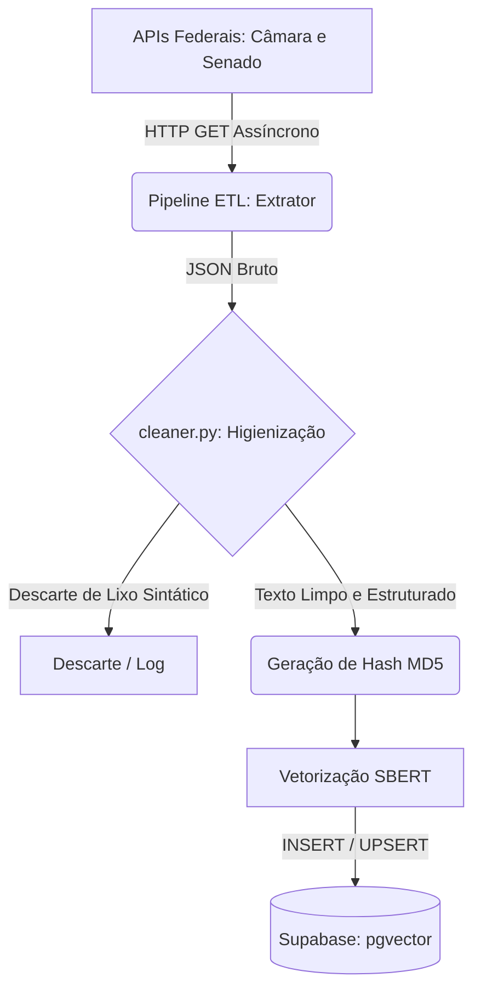

# 🗺️ O Mapa do ETL: Ingestão e Processamento de Dados

**Responsável:** João Guilherme (Engenharia de Dados / Ingestão)

Este documento detalha a arquitetura do pipeline de Extração, Transformação e Carga (ETL) do ContraDito. O objetivo desta camada é garantir a ingestão robusta de discursos, proposições e votos, aplicando higienização extrema para blindar os motores de IA contra ruídos semânticos (princípio de *Garbage In, Garbage Out*).

---

## 1. Novos Requisitos Funcionais (Área de Dados)

Para garantir o rastreio completo de contradições e a legalidade da plataforma, os seguintes requisitos foram mapeados e devem ser integrados ao escopo geral:

- **RF20 – Coleta e Tipagem de Proposições:** O pipeline ETL deve extrair, tipar e armazenar matérias legislativas, separando claramente Projetos de Lei (PLs) de Propostas de Emenda à Constituição (PECs).
- **RF21 – Mapeamento de Votos Nominais:** O sistema deve extrair de forma relacional o posicionamento exato de cada parlamentar (Sim, Não, Abstenção) vinculado à respectiva proposição.
- **RF22 – Sanitização e Prevenção de Ruídos:** O pipeline deve aplicar filtros rigorosos (limpeza HTML, notas taquigráficas) no texto bruto antes da vetorização.
- **RF23 – Rastreabilidade e Fonte Primária (Fallback):** O sistema deve capturar links diretos para a mídia original (URL do vídeo na TV Câmara ou PDF do Diário Oficial). Na ausência de vídeo, aplica-se uma lógica de *fallback* para salvar o documento oficial ou perfil.
- **RF24 – Tolerância a Falhas e Watermarking:** O pipeline deve implementar tentativas automáticas (*Exponential Backoff*) em caso de instabilidade das APIs do governo, e salvar um *watermark* (data/hora) da última extração para guiar a Carga Delta.

---

## 2. Ciclo de Vida do Dado e Arquitetura

O dado nasce bruto no servidor do Governo Federal, passa por uma limpeza rigorosa em nosso script assíncrono, é vetorizado pela IA e descansa no banco de dados para consumo imediato do Front-end.

---

## 3. Fontes Primárias e Endpoints Consumidos

A arquitetura consome diretamente a infraestrutura de Dados Abertos do Governo, garantindo respaldo na Lei de Acesso à Informação (LAI).

### Câmara dos Deputados (`/api/v2`)

**Perfis e Discursos:**

- `GET /deputados`
- `GET /deputados/{id}/discursos` — Captura transcrição, `urlVideo` e `urlTexto`.

**Ideias e Ações (PECs, PLs e Votos):**

- `GET /proposicoes?siglaTipo=PEC,PL&ano=2023` — Captura a Ementa e o PDF de inteiro teor.
- `GET /votacoes/{id_votacao}/votos` — Retorna a lista nominal: "Deputado X votou Sim/Não".

### Senado Federal

> Para evitar colisão de Chaves Primárias no banco, aplica-se um offset de `+1.000.000` nos IDs dos Senadores.

- `GET /materia/pesquisa?sigla=PEC,PL`
- `GET /votacao/materia/{codigo_da_materia}` — Captura a votação nominal dos senadores.

---

## 4. Dicionário de Dados da Ingestão (`provas_contradicao`)

Para validar o contrato entre o script de ETL e o banco de dados, a carga final obedece ao seguinte schema na tabela principal de inteligência:

| Coluna | Tipo de Dado | Regra de Negócio / Origem |
|---|---|---|
| `id` | UUID (PK) | Identificador único gerado automaticamente. |
| `politico_id` | INTEGER (FK) | ID do parlamentar (com Offset para Senado). |
| `tipo_documento` | VARCHAR | Define se a prova é `"Discurso"`, `"Voto"`, `"PL"` ou `"PEC"`. |
| `data_evento` | DATE | Data original proferida na API do Governo. |
| `texto_extraido` | TEXT | Texto 100% higienizado (`cleaner.py`). |
| `hash_discurso` | VARCHAR | Hash MD5 do texto limpo (Chave para Upsert idempotente). |
| `link_fonte` | VARCHAR | Deep link garantindo a transparência (RF23). |
| `embedding` | VECTOR(768) | Array matemático gerado pela integração com IA. |

---

## 5. Regras de Negócio e Transformação (`cleaner.py`)

Para que a Busca Semântica via SBERT funcione corretamente, o texto bruto passa por uma "lavanderia de dados" utilizando Expressões Regulares (Regex):

- **Limpeza Estrutural:** Remoção total de tags residuais de HTML (ex: `
`, ` `).
- **Filtro de Taquigrafia:** Descarte de reações do plenário, como `[Risos]`, `(Pausa)`.
- **Jargões e Protocolos:** Exclusão de frases burocráticas não-semânticas (ex: `"Sr. Presidente, peço a palavra"`).
- **Filtro de Descarte:** Discursos que resultarem em menos de 50 caracteres após a limpeza são descartados automaticamente por falta de densidade semântica.

---

## 6. Rotina de Execução e Carga no Supabase

Para garantir idempotência, todas as inserções são tratadas como `UPSERT` baseadas no `hash_discurso`, evitando duplicidade ou limite de B-Tree.

### Carga Histórica Fatiada (Backfilling)

Para povoar o banco desde 2023 sem estourar a memória/CPU do Worker NLP, a carga inicial não será executada de uma vez, mas sim iterada em blocos semestrais.

### Carga Delta (Rotina Contínua)

- **Frequência:** Semanal.
- **Janela de Execução:** Toda sexta-feira, às 03:00 da manhã.
- **Justificativa de Infraestrutura:** As atividades legislativas ocorrem primariamente de terça a quinta-feira. Executar na madrugada de sexta garante que a aplicação (Front-end e IA) consuma a base atualizada da semana durante o pico de acesso do final de semana.
